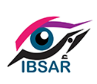
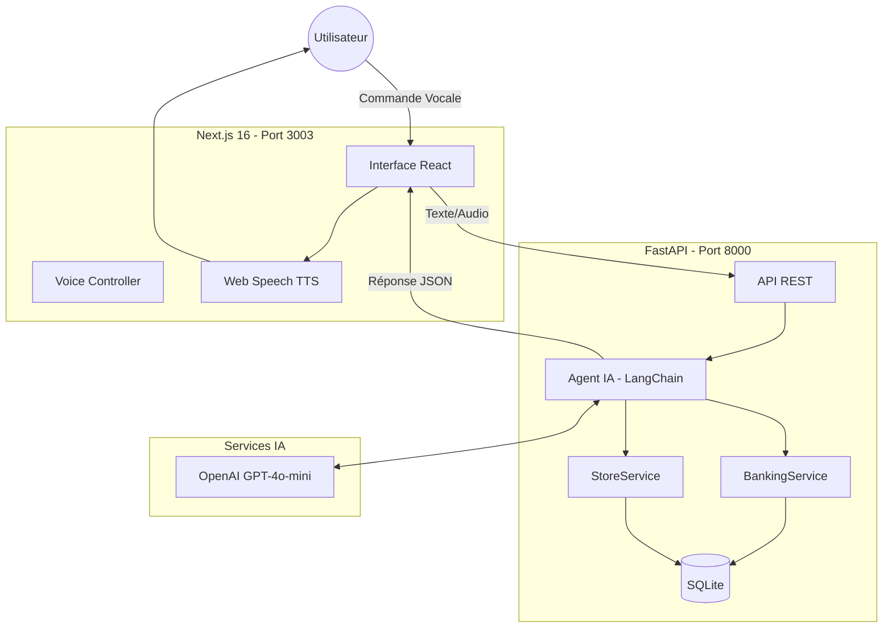

<p align="center">
  
</p>

<h1 align="center">🎙️ IBSAR - Plateforme Web Inclusive</h1>

<p align="center">
  <strong>Assistant Vocal Intelligent pour l'Autonomie Financière des Personnes en Situation de Handicap</strong>
</p>

<p align="center">
  
  
  
  
</p>

<p align="center">
  <code>#MaraTechEsprit2026</code>
</p>

---

## 📋 Table des Matières

- [Présentation du Projet](#-présentation-du-projet)
- [L'Association IBSAR](#-lassociation-ibsar)
- [Équipe Barons](#-équipe-barons)
- [Technologies Utilisées](#-technologies-utilisées)
- [Installation](#-installation)
- [Utilisation](#-utilisation)
- [Fonctionnalités Clés](#-fonctionnalités-clés)
- [Architecture Technique](#-architecture-technique)
- [Démo Vocale](#-démo-vocale)

---

## 🎯 Présentation du Projet

**IBSAR** est une plateforme web inclusive développée lors du **Hackathon MaraTech Esprit 2026** (6-8 Février 2026). Elle permet aux personnes en situation de handicap visuel de gérer leurs **opérations bancaires** et leurs **courses quotidiennes** en toute **autonomie**, grâce à une **Intelligence Artificielle vocale**.

### 🔑 Objectif Principal

> Permettre aux utilisateurs malvoyants, non-voyants ou à mobilité réduite de piloter leurs comptes bancaires et leurs achats **entièrement à la voix**, sans aucune interaction tactile ou visuelle requise.

### 🎯 Problématique Résolue

| Problème Actuel | Notre Solution |
|:---|:---|
| Dépendance aux tiers pour les transactions | Autonomie totale par commande vocale |
| Interfaces numériques inaccessibles | Navigation 100% mains-libres |
| Risques de sécurité lors des opérations | Assistant IA sécurisé et contextuel |
| Exclusion des services bancaires modernes | Inclusion financière complète |

---

## 🤝 L'Association IBSAR

<table>
<tr>
<td width="120"></td>
<td>

**Association IBSAR** *(Association pour la Culture et les Loisirs des Non et Malvoyants)*

📍 **Localisation** : Tunis, Tunisie  
👤 **Président & Référent Projet** : M. Mohamed Mansouri

**Mission** : Renforcer les capacités des personnes en situation de handicap visuel et soutenir leur autonomie et inclusion sociale.

</td>
</tr>
</table>

### 💡 Comment Notre Solution Aide l'Association

1. **Autonomie Bancaire** : Les bénéficiaires peuvent consulter leur solde et effectuer des virements sans assistance.
2. **Courses Indépendantes** : Création de listes de courses, vérification des prix, tout par la voix.
3. **Accessibilité Totale** : Interface compatible avec les lecteurs d'écran (NVDA, Jaws, VoiceOver).
4. **Sécurité Renforcée** : Plus besoin de partager ses informations bancaires avec un tiers.

---

## 👥 Équipe Barons

**Mohamed Aziz Ayari** • **Omar Fkih Hassen** • **Yassine Bouguerra**

---

## 🛠️ Technologies Utilisées

### Frontend
| Technologie | Version | Description |
|:---|:---|:---|
| **Next.js** | 16.1.6 | Framework React pour le rendu côté serveur |
| **React** | 19.2.3 | Bibliothèque UI |
| **TypeScript** | 5.x | Typage statique |
| **Tailwind CSS** | 4.x | Framework CSS utilitaire |
| **Lucide React** | 0.563.0 | Icônes SVG |
| **Web Speech API** | Native | Reconnaissance vocale (STT) & Synthèse vocale (TTS) |

### Backend
| Technologie | Version | Description |
|:---|:---|:---|
| **FastAPI** | 0.115.0 | Framework API Python haute performance |
| **Python** | 3.10+ | Langage principal backend |
| **LangChain** | 0.3.7 | Orchestration IA et agents |
| **LangGraph** | 0.2.45 | Graphe de flux pour agents |
| **OpenAI GPT-4o-mini** | Latest | Modèle de langage pour NLP |
| **SQLAlchemy** | 2.0.35 | ORM base de données |
| **SQLite** | Native | Base de données locale |
| **Qdrant** | Latest | Base de données vectorielle |

### Outils & Librairies Additionnels
| Outil | Usage |
|:---|:---|
| **FFmpeg** | Traitement vidéo LSF |
| **MediaPipe** | Détection de gestes |
| **Transformers (HuggingFace)** | Modèle SigLIP pour recherche visuelle |
| **Uvicorn** | Serveur ASGI |

---

## 📦 Installation

### Prérequis

- **Python** 3.10 ou supérieur
- **Node.js** 18 ou supérieur
- **FFmpeg** (pour le traitement vidéo)
- **Clé API OpenAI**

### Étape 1 : Cloner le Dépôt

```bash
git clone https://github.com/Asembris/EspritMaratech2026-Barons.git
cd EspritMaratech2026-Barons
```

### Étape 2 : Configuration des Variables d'Environnement

Créez le fichier `backend/.env` :

```env
OPENAI_API_KEY=sk-votre-clé-api-openai
LANGCHAIN_TRACING_V2=true
LANGCHAIN_API_KEY=votre-clé-langsmith
```

### Étape 3 : Installation du Backend

```bash
cd backend
python -m venv .venv
.\.venv\Scripts\activate  # Windows
# source .venv/bin/activate  # Linux/Mac
pip install -r requirements.txt
```

### Étape 4 : Installation du Frontend

```bash
cd frontend
npm install
```

### Étape 5 : Lancement de l'Application

**Option A : Script Automatique (Recommandé)**
```powershell
.\start_app.ps1
```

**Option B : Lancement Manuel**

Terminal 1 - Backend :
```bash
cd backend
.\.venv\Scripts\activate
python -m uvicorn app.main:app --reload --port 8000
```

Terminal 2 - Frontend :
```bash
cd frontend
npm run dev
```

### Étape 6 : Accéder à l'Application

Ouvrez votre navigateur : **http://localhost:3003**

---

## 🚀 Utilisation

### Mode Standard (Avec Écran)

1. **Accédez à l'application** via `http://localhost:3003`
2. **Cliquez sur le microphone** 🎙️ pour activer la reconnaissance vocale
3. **Parlez naturellement** : "Quel est mon solde ?" ou "Ajoute du lait au panier"
4. **Écoutez la réponse** synthétisée vocalement

### Mode Mains-Libres (Accessibilité Totale)

Pour les utilisateurs malvoyants, le mode mains-libres permet une navigation **100% vocale** :

1. L'application demande : *"Pouvez-vous voir cet écran ?"*
2. Répondez **"Non"**
3. Le mode s'active automatiquement :
   - Microphone toujours actif
   - Lecture automatique des pages
   - Commandes vocales : `"Stop"`, `"Écoute"`, `"Assistant"`

### Exemples de Commandes Vocales

| Catégorie | Commande | Action |
|:---|:---|:---|
| **Banque** | "Quel est mon solde ?" | Consulte le solde du compte |
| **Banque** | "Fais un virement de 50 dinars à Alice" | Effectue un transfert |
| **Courses** | "Ajoute du pain au panier" | Ajoute un article à la liste |
| **Courses** | "Combien coûte le lait ?" | Vérifie le prix d'un produit |
| **Navigation** | "Va à la banque" | Navigue vers la section bancaire |
| **Requête Complexe** | "Quel est mon solde et puis-je payer ma liste ?" | Analyse contextuelle multi-services |

---

## ✨ Fonctionnalités Clés

### 1. 🗣️ Assistant Vocal Intelligent (NLP)

L'assistant comprend le **langage naturel** en Français, et même en dialecte tunisien (Derja). Il utilise GPT-4o-mini pour interpréter les intentions et exécuter les actions appropriées.

- **Auto-correction** des fautes de prononciation
- **Compréhension contextuelle** des requêtes
- **Support multilingue** : Français, Arabe tunisien

### 2. 🏦 Interface Bancaire (Simulation)

- **Consultation du solde** par commande vocale
- **Virements simples** entre comptes
- **Historique des transactions**
- **Confirmation vocale** de chaque opération

### 3. 🛒 Interface Magasin / Courses

- **Création de liste de courses** intelligente
- **Recherche de produits** par nom ou catégorie
- **Vérification des prix** vocale
- **Gestion du panier** (ajout, suppression, vidage)
- **Validation par rapport au budget disponible**

### 4. 🔊 Synthèse Vocale Naturelle

- Réponses audio **fluides et naturelles**
- Compatible avec tous les navigateurs modernes
- Paramètres vocaux personnalisables

### 5. ♿ Accessibilité WCAG

- Navigation **100% clavier**
- Compatible lecteurs d'écran (NVDA, Jaws, VoiceOver)
- Mode **mains-libres** pour malvoyants
- Contraste et tailles de police adaptés

### 6. 🤟 Traduction LSF (Bonus)

- Conversion texte → vidéo en **Langue des Signes Française**
- Dictionnaire de 157 signes médicaux
- Accessibilité étendue aux personnes sourdes

---

## 🏆 Accessibilité & Inclusion (Preuve WCAG)

Le projet intègre un **Module d'Onboarding Adaptatif** unique qui configure l'interface selon les besoins spécifiques de l'utilisateur dès le premier lancement.

### 🧩 Quiz de Profilage Inclusif
Au démarrage, l'application pose 3 questions clés pour détecter le type de handicap et adapter l'UX :

1. **Test de Vision** : *"Pouvez-vous voir cet écran ?"*  
   - ➡️ **Réponse "Non"** : Activation immédiate du **Mode Aveugle** (Lecteur d'écran auto, Navigation vocale stricte, Zéro clic).
   - ➡️ **Réponse "Oui"** : Passage à l'étape suivante.

2. **Test Auditif** : *"Entendez-vous ce son ?"*  
   - ➡️ **Réponse "Non"** : Activation des **Sous-titres** et du **Support LSF** (Langue des Signes).

3. **Préférence Typographique** : *"Choisissez la taille du texte"*  
   - ➡️ Options : **Normal**, **Grand**, **Très Grand** (Adaptation dynamique de la root `html` pour malvoyants).

### ✅ Conformité WCAG 2.1
- **Perceptible** : Interfaces adaptatives (Audio/Visuel/Tactile).
- **Utilisable** : Navigation 100% vocale ou clavier.
- **Compréhensible** : Langage simplifié et feedback constant.
- **Robuste** : Compatible avec les technologies d'assistance standards.

---

## 🏗️ Architecture Technique



### Flux de Traitement Vocal

1. **Capture Audio** : Web Speech API enregistre la commande
2. **Transcription** : Conversion parole → texte
3. **Analyse NLP** : L'agent LangChain analyse l'intention
4. **Exécution** : L'outil approprié est appelé (banque, magasin, navigation)
5. **Réponse** : Génération d'une réponse naturelle
6. **Synthèse** : Lecture vocale de la réponse

---

## 🎬 Démo Vocale

### Scénario : Parcours Bancaire Complet (Sans Souris)

```
👤 Utilisateur : "Bonjour, quel est mon solde ?"
🤖 Assistant  : "Votre solde actuel est de 1 500 dinars."

👤 Utilisateur : "Fais un virement de 100 dinars à Omar"
🤖 Assistant  : "Virement de 100 dinars effectué vers Omar. Votre nouveau solde est de 1 400 dinars."

👤 Utilisateur : "Affiche mon historique"
🤖 Assistant  : "Voici vos 3 dernières transactions..."
```

### Scénario : Parcours Courses Complet

```
👤 Utilisateur : "Recherche du lait"
🤖 Assistant  : "J'ai trouvé 'Lait Délice' à 2,50 dinars. Voulez-vous l'ajouter ?"

👤 Utilisateur : "Oui, ajoute 2"
🤖 Assistant  : "2 laits Délice ajoutés au panier. Total : 5 dinars."

👤 Utilisateur : "Puis-je payer avec mon solde ?"
🤖 Assistant  : "Oui, votre solde de 1 400 dinars couvre le total de 5 dinars."
```

---

## 📄 Licence

Projet développé dans le cadre du **Hackathon MaraTech Esprit 2026** pour l'**Association IBSAR**.

---

<p align="center">
  <strong>🏆 #MaraTechEsprit2026 🏆</strong>
</p>

<p align="center">
  <em>Développé avec ❤️ par l'équipe <strong>Barons</strong></em>
</p>

<p align="center">
  <sub>Mohamed Aziz Ayari • Omar Fkih Hassen • Yassine Bouguerra</sub>
</p>
